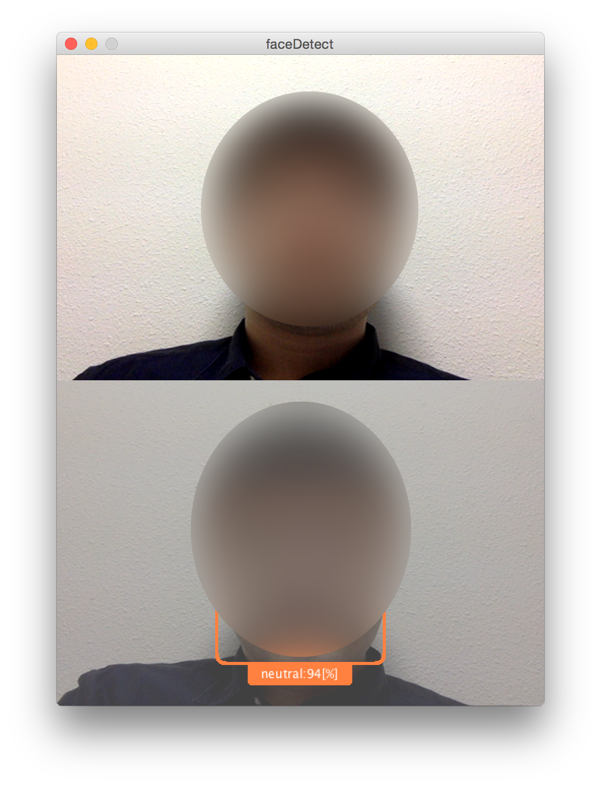

# faceDetector
Microsoftの[EmotionAPI](https://azure.microsoft.com/ja-jp/services/cognitive-services/emotion/
)を使って表情認識で遊んでみたモノ
Processing(3.x)でカメラ画像を取得しています

## 準備
- [ココ](https://www.microsoft.com/cognitive-services/en-us/)にログインしてEmotion APIのkeyを発行してもらう
- httpRequest.pde内でkeyをセットしておく

## 実行
いずれかのキーでカメラ画像を取得
画像をEmotionAPIに与えて結果を下画面に表示

## 参考リンク
- [MSのemotion APIを使ってみた]( http://memorandums.hatenablog.com/entry/2015/11/13/230542)
- [Microsoft Emotion APIを使ってみる](http://uepon.hatenadiary.com/entry/2016/10/17/003609)
